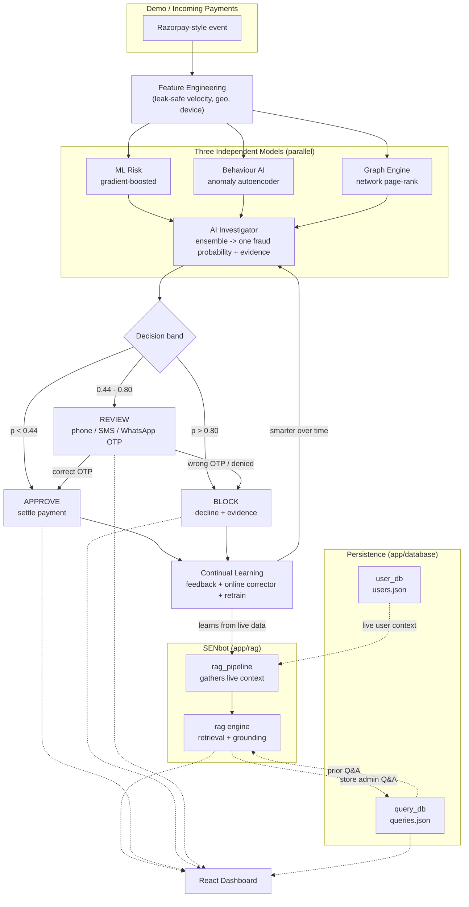

# Sentinel AI — Razorpay Fraud Guardian

An **end-to-end AI fraud-detection system** built for the Razorpay buildathon
**(Track 02 — AI Risk Manager)**, and strictly **defense-only**.

Sentinel AI watches **every payment**, explains its verdict with evidence,
**phone-confirms borderline cases** via call / SMS / WhatsApp OTP before
settling, and **learns from every outcome** over time. It ships with an honest,
held-out evaluation (no leakage), so the metrics you see are the metrics it
really would produce.

> **Live demo:** *(paste your deployed dashboard URL here — e.g. https://your-demo.onrender.com)*
> The dashboard visualises the entire pipeline: live payment checks, model
> explanations, the phone-verification panel (call / SMS / WhatsApp), and the
> SENbot admin assistant.

---

## How it works — Data Flow (DFD)



**The one-paragraph story:** every payment becomes a leak-safe feature vector,
scored in parallel by three very different models. An **AI Investigator**
combines them into one calibrated fraud probability, then picks a decision band:
low risk is **approved**, medium risk is **held for a phone call** (the customer
must confirm an OTP via call, SMS, or WhatsApp before the money moves), and high
risk is **blocked**. Every outcome feeds back so the system gets smarter and the
admin can ask questions in natural language through **SENbot**.

---

## What makes it different

- **Explainable, not a black box.** Every verdict ships with an evidence list
  (which model fired and why — velocity, geography, bot cadence, shared device,
  ensemble agreement).
- **A human safety net.** Borderline payments are *not* auto-approved. The
  customer confirms ownership via **phone call, SMS, or WhatsApp OTP** before
  settlement.
- **Learns continually.** Confirmed outcomes adapt the model immediately
  (online corrector) and on retrain — defense-only, it may only escalate a
  decision, never silently weaken it.
- **SENbot reads the live data.** A built-in RAG assistant answers
  *"what's the issue and what should I do?"* grounded in the real, current
  dataset — no embedding server or API key needed.

---

## The three models

| Model | Approach |
|-------|----------|
| **ML Risk** | Supervised gradient-boosted classifier + calibration |
| **Behaviour AI** | Unsupervised autoencoder on legit-only behaviour, reconstruction-anomaly scoring |
| **Graph Engine** | Heterogeneous payer / card / device graph + influence propagation from confirmed-fraud seeds |

Each fraud vector in the demo is engineered around a **known real-world scam**:

| Vector | Pattern |
|--------|---------|
| `CARD_TESTING` | many tiny transactions to validate stolen card numbers |
| `VELOCITY_BURST` | burst of high-value charges from one payer |
| `BOT_AUTOMATION` | machine cadence, fast typing, same device/card |
| `COLLUSION_RING` | a set of payers sharing devices/cards and cross-funding |
| `STOLEN_CARD` | new device + high value + billing/shipping mismatch |
| `UPI_P2P` | suspicious UPI peer-to-peer transfer to new beneficiary |
| `ACCOUNT_TAKEOVER` | sudden device + password change + high-value payout |
| `REFUND_ABUSE` | rapid refund requests in a short session window |
| `MERCHANT_BIN` | abnormal merchant concentration on a single BIN |

---

## Honest results (held-out test set, seed 42)

Measured on a **held-out split** the ensemble never trained on — no leakage.

| Metric | Value |
|--------|-------|
| **Precision** | **1.000** |
| **Recall (fraud blocked)** | **0.984** (182 / 185) |
| **F1** | **0.992** |
| False positives (legit blocked) | **0** |
| False negatives (fraud approved) | 3 |
| Investigator AUC | 1.000 |

**Cost outcome:** false-positive cost **Rs.0**, false-negative cost **Rs.8,466**,
**total Rs.8,466** vs. a no-intervention baseline of **Rs.3,13,247** =
**Rs.3,04,781 of money prevented**. All 3 "false negatives" landed in the
`review` (OTP confirmation) band, so they were caught by human confirmation
rather than released.

---

## Demo roles

| Role | Credentials |
|------|-------------|
| Admin | `admin` / `admin123` |

The admin has full access: live scoring, investigation reports, phone / SMS /
WhatsApp OTP verification, SENbot Q&A (with search + delete), and continual
learning retrain.

---

## Run it yourself

Requires **Python 3.10+** and **Node 18+**.

### Option A — local (recommended for development)

```bash
# Backend
cd backend
pip install -r requirements.txt
python train.py                       # one-time: train + save model artifacts
uvicorn app.main:app --port 8100      # API + serves built dashboard if present

# Dashboard (second terminal)
cd frontend/app
npm install
npm run dev
```

Open **http://localhost:5173** for the dashboard (Vite proxies `/api` to `:8100`).

On Windows you can also run `powershell -ExecutionPolicy Bypass -File start.ps1`
to launch both at once.

### Option B — Docker (single container, hardened)

Build and run in one step — no local Node or Python setup needed beyond Docker.
The image is **hardened**: it runs as a non-root user on a read-only root
filesystem, drops all capabilities, and stores **no data or secrets** in the
image (see [SECURITY.md](SECURITY.md)).

```bash
# Provide runtime secrets from the environment / secret manager
export SENTINEL_AUTH_SECRET="$(openssl rand -hex 32)"
export SENTINEL_ADMIN_PASSWORD='a-strong-admin-password'
docker compose up --build -d      # recommended (persistent volumes + hardened)
docker compose down               # stop (data is kept in volumes)
```

> The compose file requires `SENTINEL_AUTH_SECRET` and
> `SENTINEL_ADMIN_PASSWORD` (they are never hardcoded). Set them as above or
> via your secret manager. Without them `docker compose up` refuses to start.

Open **http://localhost:8100** — the built React dashboard and the FastAPI API
are both served from the same container.

> The first build takes a few minutes (it installs deps, builds the frontend
> with Vite, and trains the model). Subsequent builds are fast thanks to layer
> caching.

**Runtime data lives on persistent volumes, not in the image.** All
user-generated state — new/uploaded datasets, investigated users,
customer-care queries, feedback labels, and OTP verification log — is written
to `/app/backend/data` and `/app/backend/app/database/db` in the container.
`docker-compose.yml` mounts these as named volumes (`sentinel_data`,
`sentinel_db`) so they survive container restarts and rebuilds. With plain
`docker run`, mount them explicitly and pass secrets to keep the same
behaviour:

```bash
docker run -p 8100:8100 \
  -e SENTINEL_AUTH_SECRET="$(openssl rand -hex 32)" \
  -e SENTINEL_ADMIN_PASSWORD='a-strong-admin-password' \
  -e SENTINEL_REDACT_OTP=1 \
  -v sentinel_data:/app/backend/data \
  -v sentinel_db:/app/backend/app/database/db \
  --user 10001:10001 --read-only \
  sentinel-ai
```

Nothing is baked into the Dockerfile except static model artifacts (the approved
model version, trained at build time) and code — all runtime writes go to
volumes, and all secrets are injected at runtime.

For the full hardening runbook (secrets, auth, CORS, OTP, container
privileges, supply chain), see **[SECURITY.md](SECURITY.md)**.

---

## Tech stack

- **Backend:** FastAPI, Python, XGBoost, scikit-learn
- **Frontend:** React + Vite + Recharts
- **Extras:** offline TF-IDF RAG (SENbot), simulated Twilio phone / SMS / WhatsApp
  verification (real Twilio supported via env keys)

---

## Project layout

```
razorpay-fraud-detector/
├── backend/
│   ├── app/
│   │   ├── data_generator.py      # Razorpay-style events (9 fraud vectors)
│   │   ├── features.py            # leak-safe feature engineering (50 features)
│   │   ├── models/
│   │   │   ├── ml_risk.py         # supervised risk scorer (XGBoost)
│   │   │   ├── behaviour_ai.py    # anomaly autoencoder
│   │   │   └── graph_engine.py    # network graph model
│   │   ├── investigator.py        # ensemble + evidence
│   │   ├── verification.py        # phone / SMS / WhatsApp OTP verification
│   │   ├── feedback.py            # continual learning
│   │   ├── rag/                   # SENbot — admin Q&A (offline RAG)
│   │   │   ├── rag_knowledge.py   #   static "issues & remedies" runbook
│   │   │   ├── rag.py             #   TF-IDF retrieval + grounded answering
│   │   │   └── rag_pipeline.py    #   orchestration, feeds live DB context
│   │   ├── database/              # persisted stores (users.json, queries.json)
│   │   │   ├── user_db.py         #   user / payer database
│   │   │   └── query_db.py        #   customer-care query database
│   │   └── main.py                # FastAPI + serves built dashboard (SPA)
│   ├── train.py                   # train + save artifacts
│   └── requirements.txt
├── frontend/
│   └── app/                       # React (Vite) dashboard
│       └── src/
│           ├── App.jsx            # main dashboard shell + nav
│           ├── api.js             # API client (auth + fetch helpers)
│           └── components/
│               ├── Login.jsx          # admin login
│               ├── AdminRagPanel.jsx   # SENbot Q&A panel
│               ├── UserDatabasePanel.jsx  # investigated users + deletion
│               └── ...               # other dashboard panels
├── Dockerfile                     # single-container multi-stage build
├── docker-compose.yml             # one-command run + persistent data volumes
├── .dockerignore                  # keeps Docker image clean
├── .gitignore
├── start.ps1                      # launch both (Windows)
└── README.md
```

---

## API endpoints

| Method | Path | What it does |
|--------|------|--------------|
| POST | `/api/auth/login` | Authenticate; returns JWT + role |
| GET | `/api/summary` | Model summary + decision metrics |
| GET | `/api/events?risk=&limit=` | Recent payments with scores & decisions |
| GET | `/api/events/{event_id}` | Full investigation report for one event |
| POST | `/api/investigate` | Score a live payment (approve / review / block + evidence) |
| GET | `/api/vectors` | Fraud-vector distribution |
| GET | `/api/test-metrics` | Honest held-out precision / recall / F1 + cost |
| POST | `/api/feedback/{id}/correct` | Mark clean / fraud (continual learning) |
| POST | `/api/learning/retrain` | Retrain on confirmed feedback |
| GET | `/api/users` | Live-investigated users in the database |
| GET | `/api/users/search?q=` | Search users by phone / ID / name / merchant |
| DELETE | `/api/users/{user_id}` | Delete user + their events (admin only) |
| POST | `/api/rag/ask` | SENbot Q&A (runbook + live dataset) |
| GET | `/api/rag/status` | SENbot + pipeline source counts |
| POST | `/api/verification/{event_id}` | Start phone / SMS / WhatsApp OTP verification |
| POST | `/api/verification/{event_id}/public` | OTP verification for the review band demo |

---

## Optional real integrations

Copy `backend/.env.example` → `backend/.env` and fill in keys. `.env` is
gitignored — never commit it.

- **Razorpay keys** (`rzp_test_*`) — enable `/api/rzp/create-order` and real
  `/api/rzp/webhook` ingestion.
- **Twilio keys** (account SID, auth token, phone number) — enable real outbound
  phone / SMS / WhatsApp payment confirmation. Without keys the flow runs in
  fully simulated mode and all OTP details are logged in the dashboard.

---

Built for **Razorpay AI Buildathon — Track 02 / AI Risk Manager**. Defense-only,
explainable, and honest about its numbers.
