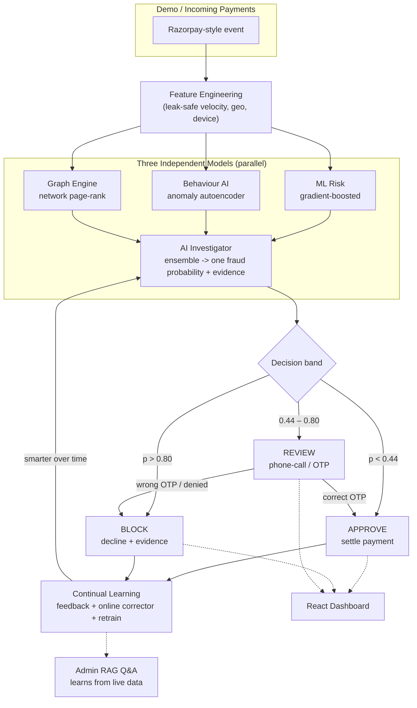

# 🛡️ Sentinel AI — Razorpay Fraud Guardian

An **end-to-end AI fraud-detection system** built for the Razorpay buildathon
**(Track 02 — AI Risk Manager)**, and strictly **defense-only**.

Sentinel AI watches **every payment**, explains its verdict with evidence,
**phone-confirms borderline cases** before settling, and **learns from every
outcome** over time. It ships with an honest, held-out evaluation (no leakage),
so the metrics you see are the metrics it really would produce.

> 🚀 **Live demo:** *(paste your deployed dashboard URL here — e.g. https://your-demo.onrender.com)*
> The dashboard visualises the entire pipeline: live payment checks, model
> explanations, the phone-verification panel, and the admin RAG assistant.

---

## How it works — Data Flow (DFD)



**The one-paragraph story:** every payment becomes a leak-safe feature vector,
scored in parallel by three very different models. An **AI Investigator**
combines them into one calibrated fraud probability, then picks a decision band:
low risk is **approved**, medium risk is **held for a phone call** (the customer
must confirm an OTP before the money moves), and high risk is **blocked**. Every
outcome feeds back so the system gets smarter and the admin can ask questions in
natural language.

---

## What makes it different

- **Explainable, not a black box.** Every verdict ships with an evidence list
  (which model fired and why — velocity, geography, bot cadence, shared device,
  ensemble agreement).
- **A human safety net.** Borderline payments are *not* auto-approved. A real
  phone call / OTP confirms ownership before settlement.
- **Learns continually.** Confirmed outcomes adapt the model immediately
  (online corrector) and on retrain — defense-only, it may only escalate a
  decision, never silently weaken it.
- **An admin that reads the live data.** A built-in RAG assistant answers
  *"what's the issue and what should I do?"* grounded in the real, current
  dataset — no embedding server or API key needed.

---

## The three models

| Model | Approach |
|-------|----------|
| **ML Risk** | Supervised gradient-boosted classifier + calibration → `p_ml` |
| **Behaviour AI** | Unsupervised autoencoder on legit-only behaviour → reconstruction-anomaly `p_behav` |
| **Graph Engine** | Heterogeneous payer / card / device graph + influence propagation from confirmed-fraud seeds → `p_graph` |

Each fraud vector in the demo is engineered around a **known real-world scam**:

| Vector | Pattern |
|--------|---------|
| `CARD_TESTING` | many tiny transactions to validate stolen card numbers |
| `VELOCITY_BURST` | burst of high-value charges from one payer |
| `BOT_AUTOMATION` | machine cadence, fast typing, same device/card |
| `COLLUSION_RING` | a set of payers sharing devices/cards and cross-funding |
| `STOLEN_CARD` | new device + high value + billing/shipping mismatch |

---

## Honest results (held-out test set, seed 42)

Measured on a **held-out split** the ensemble never trained on — no leakage.

| Metric | Value |
|--------|-------|
| **Precision** | **1.000** |
| **Recall (fraud blocked)** | **0.973** (180 / 185) |
| **F1** | **0.986** |
| False positives (legit blocked) | **0** |
| False negatives (fraud approved) | 5 |
| Investigator AUC | 0.998 |

**Cost outcome:** false-positive cost **₹0**, false-negative cost **₹18,466**,
**total ₹18,466** vs. a no-intervention baseline of **₹3,13,247** →
**₹3,04,781 of money prevented**. All 5 "false negatives" landed in the
`review` (phone-call) band, so they were caught by human confirmation rather
than released.

---

## Demo roles

| Role | Credentials |
|------|-------------|
| Admin | `admin` / `admin123` |
| Employee | `employee` / `employee123` |
| Customer care | `care` / `care123` |

---

## Run it yourself

Requires **Python 3.10+** and **Node 18+**.

```bash
# Backend
cd backend
pip install -r requirements.txt
python train.py                       # one-time: train + save model artifacts
uvicorn app.main:app --port 8100      # API

# Dashboard (second terminal)
cd frontend/app
npm install
npm run dev
```

Open **http://localhost:5173** for the dashboard. (The Vite dev server proxies
`/api` to `http://127.0.0.1:8100`.)

On Windows you can also run `powershell -ExecutionPolicy Bypass -File start.ps1`
to launch both at once.

---

## Tech stack

- **Backend:** FastAPI, Python, XGBoost, PyTorch (autoencoder)
- **Frontend:** React + Vite + Recharts
- **Extras:** offline RAG (TF-IDF), simulated Twilio phone verification
  (real Twilio supported via env keys)

---

## Project layout

```
razorpay-fraud-detector/
├── backend/
│   ├── app/
│   │   ├── data_generator.py      # Razorpay-style events
│   │   ├── features.py            # feature engineering
│   │   ├── models/
│   │   │   ├── ml_risk.py         # supervised risk scorer
│   │   │   ├── behaviour_ai.py    # anomaly autoencoder
│   │   │   └── graph_engine.py    # network graph model
│   │   ├── investigator.py        # ensemble + evidence
│   │   ├── verification.py        # phone-call payment confirmation (OTP)
│   │   ├── feedback.py            # continual learning
│   │   ├── rag/                     # admin Q&A (offline RAG)
│   │   │   ├── rag_knowledge.py     #   static "issues & remedies" runbook
│   │   │   ├── rag.py               #   retrieval + grounded answering
│   │   │   └── rag_pipeline.py      #   orchestration, feeds live DB context
│   │   ├── database/                # persisted stores (users.json, queries.json)
│   │   │   ├── user_db.py           #   user / payer database
│   │   │   └── query_db.py          #   customer-care query database
│   │   └── main.py                # FastAPI
│   ├── train.py                   # train + save artifacts
│   └── requirements.txt
├── frontend/
│   └── app/                       # React (Vite) dashboard
│       └── src/App.jsx
├── start.ps1                      # launch both (Windows)
└── README.md
```

---

Built for **Razorpay AI Buildathon — Track 02 · AI Risk Manager**. Defense-only,
explainable, and honest about its numbers.
